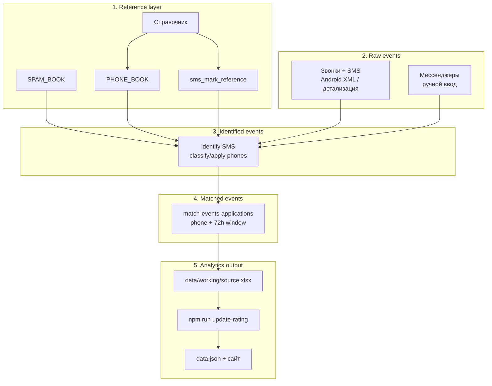
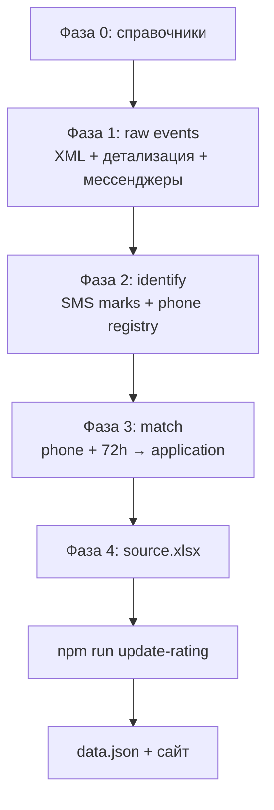

# Шпаргалка: рейтинг застройщиков

Один проект — [`projects/developer-response-rating/`](.). Всё остальное в workspace (парсеры, скиллы в `.cursor/skills/`) — **инструменты агента**, не ваши.

Технические детали сайта и метрик — в [README.md](README.md).

## Документация

- [Ретро Q2 2026 и рекомендации на следующий замер](docs/retro-2026-q2.md) — выводы цикла, диагностика, цели KPI, чеклисты (`npm run export-retro-metrics` для пересчёта цифр).

---

## Дизайн исследования

| Параметр | Значение |
|----------|----------|
| Застройщиков в рейтинге | **100** (100 сайтов) |
| Заявок на застройщика | **21** (план; фактически может быть меньше, если форма не сработала) |
| Всего заявок (план) | **2100** |
| SIM для заявок | **21** уникальный номер телефона |
| Мессенджеры на каждой SIM | WhatsApp, Telegram, Max (63 аккаунта; в аналитике важнее звонки и SMS) |
| Входящие события | ~10 000 звонков, SMS и сообщений в мессенджерах |
| Окно аналитики | **72 часа** после `application_datetime` |

Заявки отправлялись несколько дней; после последней волны ждали ещё ~3 дня, чтобы перезвоны по последним заявкам успели дойти в окно 72 ч.

---

## Ключевая логика

Два разных вопроса — два разных слоя:

1. **К какой заявке относится контакт?**  
   Ответ: по **уникальному номеру телефона заявки** (`phone_number` в `applications all`) + **времени события** в окне 72 ч после заявки.

2. **Имеем ли мы право считать этот контакт ответом застройщика?**  
   Ответ: через **справочники** — `PHONE_BOOK`, `sms_mark_reference`, `SPAM_BOOK`. Без идентификации звонящего/отправителя event нельзя включать в метрики рейтинга.

**Инвариант аналитики:** в рейтинг попадают только события, где:
- контакт **идентифицирован** как застройщик (`identified = да`);
- event **привязан** к заявке (`application_id` заполнен);
- `application_datetime <= event_datetime <= application_datetime + 72h`.

**Участники рейтинга:** список застройщиков и знаменатель **N** берутся из листа `applications` (фактически отправленные заявки). События добавляют ответы, каналы и касания; застройщик без отклика остаётся в таблице с `avg_response = null` и «Без ответа, %» = 100.

События **позже 72 часов** можно хранить в таблице для аудита, но **не учитывать** в метриках.

---

## Пять слоёв данных



| Слой | Что это | Где живёт |
|------|---------|-----------|
| **1. Reference** | Кто застройщик, чьи номера/SMS-маркировки, что спам | Мастер-шаблон + `data/reference/` (см. фазу 0) |
| **2. Raw events** | Сырые входящие контакты без привязки к заявке | `data/inbound/` (парсеры, telecom, экспорт мастера) |
| **3. Identified** | События с `developer_id` / `identified` после lookup | Промежуточные xlsx после `identify-event-developers`, `classify-phones`, `apply-phones` |
| **4. Matched** | События с `application_id`, `lead_response_time`, `recontact` | Листы `Events_sms_calls` + `Events_messengers` после match |
| **5. Analytics** | Агрегаты для публичного сайта | `data/working/source.xlsx` (оба листа) → `data.json` |

**Мастер-шаблон (Google Sheets) — единая таблица правды:**

| Вкладка | Назначение |
|---------|------------|
| `legend` | 100 застройщиков |
| `phone_book` | Белый список входящих номеров (обогащать) |
| `sms_book` | SMS-маркировки → developer (обогащать) |
| `applications` | заявки |
| `events_messengers` | Мессенджеры, **вручную**; ключи `E-M-0001` |
| `events_sms_calls` | Спарсенные SMS + звонки; ключи `E-SC-0001` |
| `devices` | SIM ↔ устройство; технический лист для людей, в аналитике не участвует |
| `spam_prefixes` | Проверенные спам-префиксы |
| `spam_phones` | Проверенные спам-номера |

**Два источника events (слой 2):**

| Лист | Каналы | Ключ event_id | Как собирается |
|------|--------|---------------|----------------|
| `events_sms_calls` | звонки, SMS | `E-SC-0001` | парсеры Android / детализация |
| `events_messengers` | WhatsApp, Telegram, Max | `E-M-0001` | ручной ввод |

Одинаковый контракт колонок на обоих листах. При сборке `data.json` код **автоматически читает оба** листа из `data/working/source.xlsx` и объединяет.

---

## Что важно помнить

| Что | Где | Зачем |
|-----|-----|--------|
| **Справочники** (фаза 0) | Мастер-шаблон + `data/reference/` | Идентификация: застройщик / спам / unknown |
| Заявки | Мастер-шаблон, лист `applications` | Ключ матча: `developer_id` + `phone_number` + ближайшее время заявки |
| События (финал) | `data/working/source.xlsx` | Главный вход для `update-rating` |
| SPAM_BOOK | мастер `spam_phones` / `spam_prefixes`, `data/reference/spam_book.xlsx` | Проверенный спам |
| Runtime реестр звонков | `data/working/phone_registry.json` | Кэш после `seed-spam` + авто-классификация |
| Неизвестные номера (ручная разметка) | `data/working/phones_to_identify.xlsx` | После `classify-phones` / `export-phones-identify` (в `update-rating`) |
| Готовый рейтинг | `data.json` | Генерируется автоматически |

Файлы `lookup_*.log`, `phone_overrides.json`, `incoming_phones*` — старые прогоны агентов, **можно не открывать**.

---

## Фаза 0: справочники (до парсинга и анализа)

Прежде чем гонять выгрузки и считать рейтинг, должны быть собраны **четыре отдельных справочника**. Это не одна таблица: у каждого свой ключ поиска.

| Справочник | Ключ | 1 строка = | Зачем |
|------------|------|------------|--------|
| **legend** | `developer_id` | один застройщик | Имя, сайт, стабильный ID (100 застройщиков) |
| **phone_book** | `phone_number` | один входящий номер | Белый список: кто звонил — застройщик |
| **sms_book** | `sms_mark` | одна SMS-маркировка | Кто прислал маркированное SMS |
| **spam_phones / spam_prefixes** | `phone_number` + `prefix` | номер или маска пула | Проверенный спам: номера и префиксы КЦ/риэлторов |

Правило нормализации: **сущность застройщика** живёт только в Справочнике; телефоны и маркировки — в плоских lookup-таблицах со ссылкой на `developer_id`.

### Где что лежит

| Справочник | Где правите вы (Excel) | Откуда читает агент |
|------------|------------------------|---------------------|
| legend | Мастер-шаблон, лист `legend` | `sync-reference-from-master`, `match-events` |
| phone_book | Мастер-шаблон, лист `phone_book` | `classify-phones` / `apply-phones` через `data/reference/developer_official_phones.xlsx` |
| sms_book | Мастер-шаблон, лист `sms_book` | `apply-sms-book` через `data/reference/sms_mark_reference.xlsx` |
| spam_phones / spam_prefixes | Мастер-шаблон, листы `spam_phones` + `spam_prefixes` | `npm run seed-spam` → `data/reference/spam_book.xlsx` → `phone_registry.json` |

Дополнительно в мастер-шаблоне (не справочник, но нужен до матча):

| Лист | Зачем |
|------|--------|
| `applications` | заявки: `developer_id`, `phone_number`, `application_datetime` |
| `devices` | Какой SIM на каком девайсе (для `--sim` при парсинге Android) |

### Порядок сборки справочников

1. **legend** — все 100 застройщиков (`developer_id`, `developer_name`, `url`). Без дублей по ID.
2. **sms_book** — все известные sender'ы из SMS (`EDINO`, `COM-PRO`, `PSK-DOM`…).
3. **phone_book** — официальные и проверенные входящие номера застройщиков.
4. **spam_phones / spam_prefixes** — проверенный спам (`confidence = high` если ≥3 номера в пуле).
5. **Синхронизация в проект** — `npm run sync-reference-from-master` пересобирает `data/reference/` и обновляет `data/manifest.json` (см. [DATA-LAYOUT.md](DATA-LAYOUT.md)).
6. **`npm run seed-spam`** — загрузить SPAM_BOOK в `phone_registry.json`.
7. **Только потом** — парсинг выгрузок, identify, match, `npm run update-rating`.

`phone_registry.json` — **runtime-кэш**: результат `seed-spam` + авто-накопление при `classify-phones`. Источник правды для спама — **SPAM_BOOK** в мастере, не JSON.

### Чеклист «справочники готовы»

- [ ] В Справочнике ровно 100 застройщиков, ID уникальны
- [ ] В sms_mark_reference нет «дыр» по sender'ам (иначе `unknown_sms_mark` при identify)
- [ ] В PHONE_BOOK есть подтверждённые номера колл-центров (иначе звонки уйдут в `phones_to_identify.xlsx`)
- [ ] В SPAM_BOOK загружены проверенные спам-номера и префиксы (`npm run seed-spam`)
- [ ] `applications` актуален: все 100 `developer_id`, уникальные SIM-номера; план 2100 заявок, фактический объём может быть меньше

### Что сказать агенту (фаза 0)

> Обнови справочники из `[Мастер шаблон.xlsx]`: Справочник, PHONE_BOOK, sms_mark_reference → синхронизируй в `data/reference/` и CSV скилла.

> Добавь в sms_mark_reference маркировку `[sender]` → `[застройщик]`, пересобери справочник.

> Обнови SPAM_BOOK из `Идентификация номеров.xlsx` → мастер-шаблон → `data/reference/spam_book.xlsx` → `npm run seed-spam`.

---

## Фазы 1–4: от сырых events до source.xlsx

### Фаза 1. Сбор raw events

| Действие | Скилл / команда |
|----------|-----------------|
| Парсинг Android XML (звонки + SMS) | `android-call-log-parser` |
| Парсинг детализации Beeline/T2 | `telecom-detailization-parser` |
| Мессенджеры | Ручной ввод в таблицу events |

> Распарсь папку `[путь к calls-*.xml и sms-*.xml]` за период `[даты]`, SIM `[номера]`.

> Распарсь детализацию `[путь к файлу]`.

### Фаза 2. Идентификация контакта

| Канал | Как идентифицируем | Скилл / команда |
|-------|-------------------|-----------------|
| SMS | `sms_mark_reference` → `developer_id` | `identify-event-developers` |
| Звонки | `PHONE_BOOK` + `SPAM_BOOK` → `phone_registry.json` | `classify-phones`, `apply-phones` |
| Мессенджеры | Уже указан `developer_name` при ручном вводе | — |

> Идентифицируй застройщиков в `[путь к merged xlsx]` по мастер-шаблону.

**Цикл ручной разметки неизвестных звонков** (канонический путь):

1. `npm run export-phones-identify` → `data/working/phones_to_identify.xlsx`
2. Разметить: `developer_name` = застройщик **или** `Спам = спам`
3. Dev-номера → лист `PHONE_BOOK` в мастер-шаблоне → `data/reference/developer_official_phones.xlsx`
4. Спам-номера → листы `SPAM_PHONES` / `SPAM_PREFIXES` → `data/reference/spam_book.xlsx`
5. `npm run seed-spam` (обязательно после обновления SPAM_BOOK)
6. `npm run update-rating`

**Внимание: порядок `seed-spam` и `seed-phones`**

`npm run seed-phones` по умолчанию **мержит** с существующим `phone_registry.json` (manual entries не перезаписывает). Флаг `--replace` — полный сброс.

Безопасный порядок:
1. Обновить мастер-шаблон (`PHONE_BOOK`, `SPAM_BOOK`)
2. `npm run seed-spam` — загрузить SPAM_BOOK
3. `npm run seed-phones -- --seed "…xlsx"` — импорт ручной разметки (merge)
4. При необходимости снова `npm run seed-spam`

### Разметка unknown-номеров пулами

1. `npm run export-phones-identify` → `data/working/phones_to_identify.xlsx`
2. `npm run suggest-spam-prefixes` → `data/working/spam_prefix_candidates.xlsx` (пулы ≥3 номеров)
3. Подтверждённые spam-пулы → лист `SPAM_PREFIXES` в мастер-шаблоне
4. Оставшиеся singleton → `developer_name` в PHONE_BOOK или `Спам = спам` в SPAM_PHONES
5. `npm run seed-spam` → `npm run update-rating`

### Фаза 3. Матчинг events → applications

**Правило:** event привязывается к заявке, если:
- `phone_number` event = `phone_number` заявки (**уникальный ключ**, 2100 заявок);
- `application_datetime <= event_datetime <= application_datetime + 72h`;
- контакт идентифицирован как застройщик (`identified = да`) — до матча или после identify.

`developer_id` в event — проверка качества (warning при расхождении).

> Сметчи события с заявками в `[Мастер шаблон.xlsx]` — **два прогона**: `--sheet "Events_sms_calls"` и `--sheet "Events_messengers"`.

Скилл: `match-events-applications`. Заполняет `application_id`, `lead_response_time` (**минуты**, max 4320), `recontact`.

### Фаза 4. Финальный source.xlsx

В `data/working/source.xlsx` (копия/экспорт мастер-шаблона) — **два листа событий** с одинаковыми колонками:

- `Events_sms_calls` — автоматические SMS/звонки (`E-SC-`)
- `Events_messengers` — мессенджеры (`E-M-`)

`npm run update-rating` / `build-data` читают **оба** листа и объединяют перед агрегацией.

Обязательные поля:

| Поле | Зачем |
|------|--------|
| `event_id` | Уникальный ID события |
| `application_id` | Связь с заявкой (пусто → не в метриках ответа) |
| `developer_id`, `developer_name`, `url` | Застройщик |
| `phone_number` | Номер SIM заявки (recipient) |
| `application_datetime` | Время заявки |
| `event_channel` | `call` / `sms` / `whatsapp` / `telegram` / `max` |
| `event_datetime` | Время контакта |
| `incoming_phone_number` | Номер звонящего (для call) |
| `lead_response_time` | Минуты от заявки до контакта (0–4320 = 72 ч) |
| `recontact` | `да` / `нет` — повторное касание по заявке |
| `identified` | `да` / `нет` — только `да` идёт в метрики |

---

## Главная команда (финальный пересчёт)

`npm run update-rating` — **не полный pipeline** от 10k сырых events. Это финальный шаг **после** подготовки `data/working/source.xlsx` (фазы 0–4):

```bash
npm run update-rating
```

По порядку: `classify-phones` → `export-phones-identify` → `apply-phones` (разметка звонков) → `build-data` (агрегат → `data.json`).

Посмотреть сайт локально:

```bash
npm run serve
```

Откроется http://localhost:4321

Первый раз на машине: `npm install` (один раз).

---

## QA-чеклист перед финальной сборкой

Перед `npm run update-rating` и деплоем:

```bash
npm run validate-pipeline          # JSON-отчёт по source.xlsx
npm run validate-pipeline --strict # exit 1 если есть events вне 72 ч
```

- [ ] **Applications:** валидные строки имеют `developer_id`, `phone_number`, `application_datetime`; phone уникален; `developers_with_applications = 100` в `validate-pipeline`
- [ ] **SMS:** unknown-маркировки разобраны или явно исключены из метрик
- [ ] **Звонки:** unknown phones выгружены (`export-phones-identify`) и обработаны; dev → PHONE_BOOK, spam → SPAM_BOOK / SPAM_PREFIXES
- [ ] **72h:** `outside_window` при match = 0 в аналитике; `lead_response_time > 4320` не в метриках (фильтр в match + aggregate)
- [ ] **Match:** события без `application_id` не попадают в метрики ответа (звонки-спам / unmatched — только в `spam_share`)
- [ ] **Identified:** только `identified = да` учитывается в метриках рейтинга
- [ ] **Знаменатель:** N по каждому застройщику = число валидных строк в `applications`, не дефолт 21
- [ ] **Выход:** `data.json` с `"demo": false`, `developers_count = 100`, без PII (телефоны, ID заявок)

---

## Полный цикл замера



1. **Фаза 0** — справочники (100 застройщиков, PHONE_BOOK, sms_mark, SPAM_BOOK).
2. **Фаза 1** — парсинг ~10k входящих событий с 21 SIM.
3. **Фаза 2** — identify SMS по маркировке; classify/apply звонков по white list и spam book.
4. **Фаза 3** — match к 2100 заявкам по номеру + окно 72 ч.
5. **Фаза 4** — итог в `data/working/source.xlsx`.
6. **`npm run update-rating`** → `npm run serve` или деплой.

---

## Сценарии: что сказать агенту в Cursor

Скопируйте фразу в чат — агент сам найдёт скрипты в `.cursor/skills/`.

### Новая выгрузка с Android (XML звонков/SMS)

> Распарсь папку `[путь к папке с calls-*.xml и sms-*.xml]` за период `[даты]`, SIM `[номера]`.

### Детализация Beeline (PDF) или T2 (Excel)

> Распарсь детализацию `[путь к файлу]`.

### Свести SMS с застройщиками

> Идентифицируй застройщиков в `[путь к merged xlsx]` по мастер-шаблону.

### Привязать события к заявкам

> Сметчи события с заявками в `[Мастер шаблон.xlsx]` — **два прогона**: `--sheet "Events_sms_calls"` и `--sheet "Events_messengers"`.

### Обновить рейтинг на сайте

> Обнови рейтинг: `npm run update-rating` в `developer-response-rating`.

Или сами: актуальный лист в `data/working/source.xlsx` → `npm run update-rating`.

### Выгрузить неизвестные номера для разметки

```bash
npm run export-phones-identify
```

Результат: `data/working/phones_to_identify.xlsx` — звонки без спама/застройщика, с флагом `suspicious_spam`.

### Импорт таблицы «Идентификация номеров.xlsx»

| Лист | Колонка | Куда |
|------|---------|------|
| `Телефоны` | застройщик | Сверка / замена `PHONE_BOOK` |
| `events messengers` | `developer_name` | **Добавить** в `PHONE_BOOK` |
| `events messengers` | `Спам = спам` | **Добавить** в `SPAM_PHONES` |

```bash
npm run seed-spam          # SPAM_BOOK → phone_registry.json
npm run seed-phones -- --seed "/путь/…"   # merge ручной разметки
npm run update-rating
```

---

## Все npm-команды

| Команда | Когда |
|---------|--------|
| `npm run update-rating` | **Финальный пересчёт** (после подготовки source.xlsx) |
| `npm run classify-phones` | Классификация unknown звонков → registry |
| `npm run apply-phones` | Проставить `developer_*` / `identified` в source.xlsx (только call) |
| `npm run build-data` | Только пересчитать data.json |
| `npm run seed-spam` | SPAM_BOOK → registry (номера + префиксы) |
| `npm run validate-pipeline` | QA-отчёт по `data/working/source.xlsx` перед сборкой |
| `npm run suggest-spam-prefixes` | Кандидаты SPAM_PREFIXES из `phones_to_identify.xlsx` |
| `npm run seed-phones` | Импорт dev+spam из xlsx в registry (**merge**; `--replace` для сброса) |
| `npm run export-phones-identify` | Выгрузка unknown → `phones_to_identify.xlsx` (приоритет: in-72h-same-SIM) |
| `npm run audit-spam-ranges` | Аудит DEFAULT_SPAM_RANGES vs unknown/dev → `spam-range-audit.xlsx` |
| `npm run preflight-developer-urls` | Проверка URL из legend (`--dry-run` без HTTP) |
| `npm run export-retro-metrics` | Метрики ретро + Q3 KPI → `retro-2026-q2-metrics.json` |
| `npm run export-match-audit` | Аудит сирот → `match-audit.xlsx` |
| `npm run migrate-data` | Перенос из legacy `private/` в `data/` (`--apply`) |
| `npm run serve` | Локальный просмотр сайта |
| `npm test` | Проверки для разработки |

---

## Куда не лезть

- `.cursor/skills/` — рецепты для агента, не ручная установка.
- `build/`, `shared/` — код сборки; менять только через агента.
- `node_modules/` — зависимости после `npm install`.
